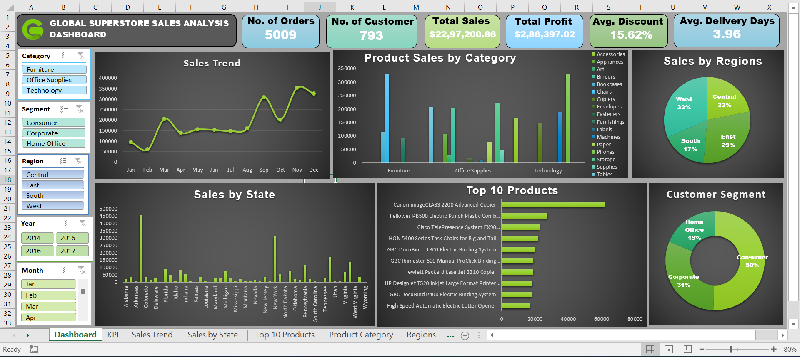

# 📊 Global Superstore Sales Dashboard (Excel)

An **interactive Excel dashboard** analyzing the sales performance of the [Global Superstore dataset](https://www.kaggle.com/datasets/vivek468/superstore-dataset-final).  
This project provides insights into **sales trends, product performance, regional growth, and customer segmentation** — helping decision-makers identify opportunities and optimize strategies.  

💼 This dashboard helps uncover key business insights from Global Superstore data, enabling better decisions on product, region, and customer strategies.

---

## 📸 Dashboard Preview

---

## 🚀 Key Features

- **KPI Cards**:
  - 📦 Orders
  - 👥 Customers
  - 💰 Sales
  - 📈 Profit
  - 🎯 Discount %
  - 🚚 Avg. Delivery Days

- **Charts & Visuals**:
  - 📅 Sales Trend (Month/Year)
  - 📊 Category & Sub-category Performance
  - 🗺️ Sales by State & Region
  - 🏆 Top 10 Products
  - 👥 Customer Segment Share

- **Interactive Filters**:
  - Year | Month | Region | Category | Segment

---

## 💡 Key Insights from the Dashboard

- 📈 **Overall Sales Performance**:  
  Total sales reached **$22.97M** with a total profit of **$286K**, across **5,009 orders** and **793 customers**.

- 🛒 **Category Insights**:  
  - *Technology* and *Furniture* categories contributed the highest sales.  
  - *Office Supplies* had steady sales but comparatively lower profit margins.

- 🌎 **Regional Insights**:  
  - **West Region (32%)** recorded the highest contribution to overall sales.  
  - **Central Region (22%)** showed lower profit percentage, suggesting higher costs or discounts.  

- 👥 **Customer Segmentation**:  
  - *Consumer Segment* dominated with **50% of total sales**.  
  - *Corporate* and *Home Office* accounted for 31% and 19%, respectively.

- 🏆 **Top-Performing Products**:  
  - *Canon imageCLASS 2200 Advanced Copier* and *Fellowes PB500 Binder* led the sales list.  
  - Top 10 products are mostly from **Technology and Office Supplies**, indicating strong demand in these categories.

- 📆 **Sales Trend**:  
  - Noticeable peaks observed in **March, September, and November**, hinting at seasonal or promotional sales spikes.

---

## 🛠 Tools & Techniques

- **Microsoft Excel 2016**
  - Pivot Tables & Pivot Charts  
  - Slicers & Timeline Filters  
  - KPI Cards  
  - Custom Chart Formatting & Layout Design  

---

## 📂 Files in this Repository

| File | Description |
|------|--------------|
| [`Superstore_rawdata.csv`](Superstore_rawdata.csv) | Original dataset |
| [`Superstore_Dashboard.xlsx`](Superstore_Dashboard.xlsx) | Final interactive Excel dashboard |
| [`Dashboard_Screenshot.png`](Dashboard_Screenshot.png) | Dashboard preview |
| [`README.md`](README.md) | Project documentation |

---

## 📊 Dataset

- **Source**: [Kaggle - Superstore Dataset](https://www.kaggle.com/datasets/vivek468/superstore-dataset-final)  
- **License**: Public dataset — free for analysis and learning purposes.  

---

## ⚙️ How to Explore

1. Download the `Superstore_Dashboard.xlsx` file.  
2. Open it in **Excel 2016 or later**.  
3. Use the **slicers** to filter by *Year, Month, Region, Category,* or *Segment*.  
4. Watch KPIs and charts update interactively to explore different insights.

---

## 🧠 Author

**👤 Harsh Belekar**  
📍 *Data Analyst | Python | SQL | Power BI | Excel | Data Visualization*  
🌐 [LinkedIn](https://www.linkedin.com/in/harshbelekar) | 💻 [GitHub](https://github.com/Harsh-Belekar)  
📧 **harshbelekar74@gmail.com**

---

### ⭐ If you found this project insightful, don’t forget to give it a star on [GitHub!](https://github.com/Harsh-Belekar)
